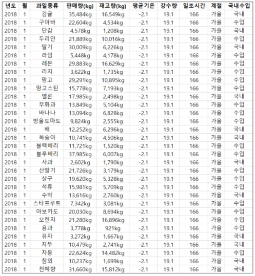
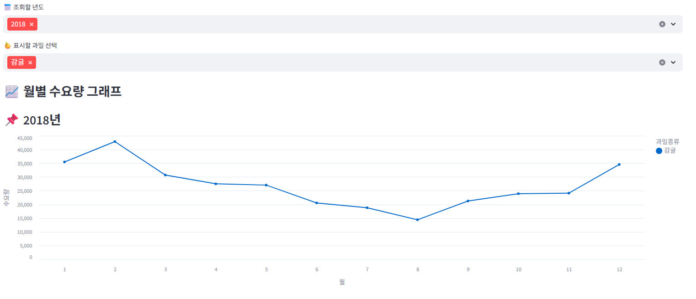
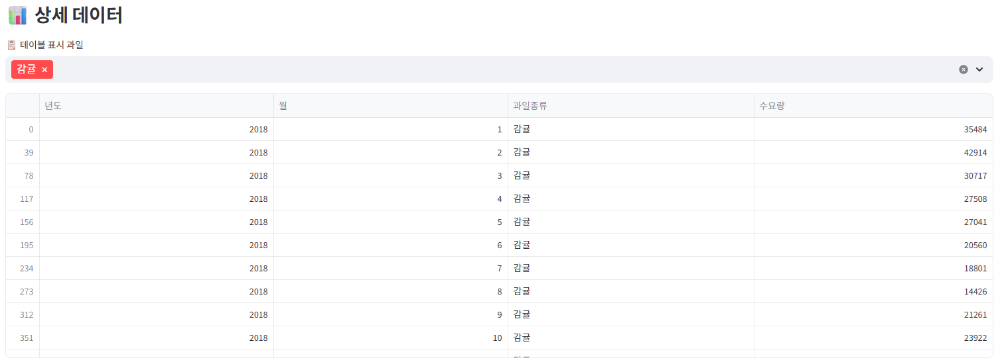
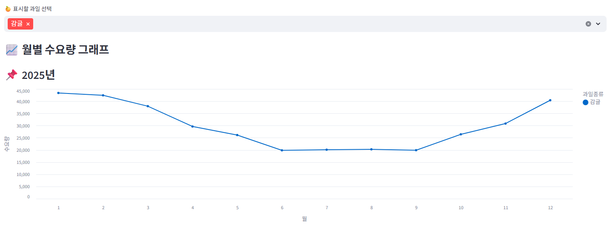
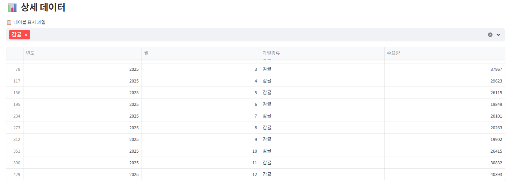

# MindLab

## 💫 개발 개요
과거 데이터, 일기 데이터를 활용한 과일 판매 수요량 예측 모델

## 🕒 개발 시간
2025/11/03 ~ 2025/11/28 (약 4주간)

## 🤝 같이 개발한 팀원들
🐯 성득명 : 스트림릿  
🐱 박선영 : 모델 구성  
🐻 이 호 : 모델 구성  
🦁 김태훈 : 데이터 준비

 

## 📂 프로젝트 보고서
[MindLab 결과보고.pdf](./img/MIND_LAB.pdf)

 

## 📜 프로젝트 소개
→ 과거(2018 ~ 2024) 과일 판매량 데이터를 기반으로 2025년 과일 판매량을 예측  
→ 모델을 통해서 예측한 결과를 엑셀로 저장 
→ 스트림밋을 사용해서 프론트 구성 

 

## 📢 기획 의도
과일과 같은 신선식품은 보관 기간이 매우 짧고 수요 변동이 큰 특성을 가지고 있습니다. 이러한 특성 때문에 재고를 과도하게 확보하면 폐기율 증가로 인한 손실이 발생하고, 반대로 재고가 부족하면 판매 기회 손실로 이어질 수 있습니다.

본 프로젝트는 2018년부터 2024년까지의 과일 판매 데이터를 기반으로 2025년 판매량을 예측하는 모델을 구축하는 것을 목표로 합니다. 이를 통해 신선식품 유통 과정에서 발생하는 불확실성을 줄이고, 보다 효율적인 의사결정을 지원하고자 합니다.

예측 모델을 활용하여 다음과 같은 효과를 기대할 수 있습니다:

📉 폐기 및 손실률 감소

📈 적정 재고 유지 및 발주 효율화

📊 데이터 기반의 안정적인 수요 예측

본 수요 예측 시스템은 신선식품 유통 과정의 효율성을 높이고, 실제 운영에서 발생하는 비용을 절감하는 데 도움을 주는 것을 주요 목적입니다.

 

### 🚀 개발 환경
| Tool | Description |
|------|-------------|
| [Google Colab](https://colab.research.google.com/) | 모델 학습 및 데이터 전처리 수행 |
| [Streamlit](https://streamlit.io/) | 예측 결과를 시각화하고 웹 대시보드 형태로 제공 |
| [Figma](https://www.figma.com/) | UI/UX 기획 및 와이어프레임 제작 |
| [Hugging Face](https://huggingface.co/) | 모델 업로드 및 배포 환경 구성 |
| [GitHub](https://github.com/) | 프로젝트 버전 관리 및 협업 |

### 🏷️ Tool Badges

  
  
  
  
  

 

## 📚 학습 데이터

 

## ✨ 주요 기능

### 1. 📅 년도 및 과일 선택 기능
Streamlit UI에서 **년도와 과일 종류를 직접 선택**하면 해당 조건에 맞는 데이터를 기반으로  
- **그래프 시각화**
- **데이터 시트(테이블) 출력**  
이 즉시 반영되어 보기 쉽게 시각화됩니다.

### 2. 📊 과거 데이터 시각화 페이지
과거 실제 판매량(2018~2024)을 그래프와 표 형태로 제공하여  
- 연도별 트렌드 분석  
- 월별/품목별 패턴 확인  
이 가능하도록 구성했습니다.

### 3. 🔮 예측 데이터 시각화 페이지
2025년 예측 결과만을 별도 페이지에서 확인할 수 있도록 설계했습니다.  
- 예측 모델이 출력한 미래 판매량 그래프  
- 예측값 테이블 제공  
으로 실질적인 수요 예측 활용에 초점을 두었습니다.

### 4. 📂 페이지 분리 구조
과거 데이터 페이지와 예측 데이터 페이지를 **명확히 분리**해  
- 데이터 혼동 방지  
- 사용자가 원하는 정보에 빠르게 접근 가능  
하도록 UI 구조를 최적화했습니다.

 

## 📚 배운점
- 🐯: 성득명 
프로젝트를 진행하면서 모델을 구성하는 단계에서는 동원훈련으로 충분히 참여하지 못해 아쉬움이 컸습니다.  하지만 이후 스트림릿으로 대시보드를 만들고 허깅페이스에 배포하는 과정에서 많은 것을 배울 수 있었습니다.  스트림릿은 처음 사용해보았지만, 간단하게 프론트 화면을 구성할 수 있어 새로운 경험이 되었고 프로젝트 완성도에도  도움이 되었습니다.

- 🐱: 박선영 
이번 AI 프로젝트는 처음엔 막막했지만, 직접 데이터를 다루고 모델을 
만들어 보면서 AI가 어떻게 작동하는지  실감할 수 있었습니다. 특히 결과가
 잘 나오지 않을 때의 답답함과 해결했을 때의 성취감이 강하게 남았습니다. 
어려움도 있었지만 그만큼 많이 배우고 성장한 의미 있는 시간이었습니다.

- 🐻: 이 호 
처음 프로젝트를 시작했을 때는 AI 부분이 너무 어려워 잘 해낼 수 있을까? 걱정도 됐지만, 직접 만들어 보고 부딪히면서  배우는 재미도 느낄 수 
있었습니다. 진행하면서 부족한 부분을 다시 공부하고, 오류를 고치며 
이해가 깊어지는 경험을  했습니다. 쉽지 않았지만 팀원들과 함께 
해결해 가며 성장할 수 있었고, 그 과정 자체가 큰 배움이었습니다. 
앞으로도 배운 내용을 직접 적용하며 더 발전하고 싶습니다. 
함께한 팀원들에게 고맙다는 말을 전하고 싶습니다.

- 🐲: 김태훈 
이번 프로젝트를 통해 수업 시간에 배웠던 내용을 직접 적용하며
이해가 부족했던 부분을 알아가고 자연스럽게  복습할 수 있었습니다.
 또한 다양한 모델을 직접 구현해보며 이론으로만 배웠던 내용이
 실제 데이터에서  어떻게 작동하는지 확인하고 경험할 수 있었습니다.
이를 통해 확실히 이해가 더 되었고 다음에 비슷한 프로젝트를 
진행한다면 지금보다 더 수월하게 모델을 구축할 수 있을 것 같습니다.

